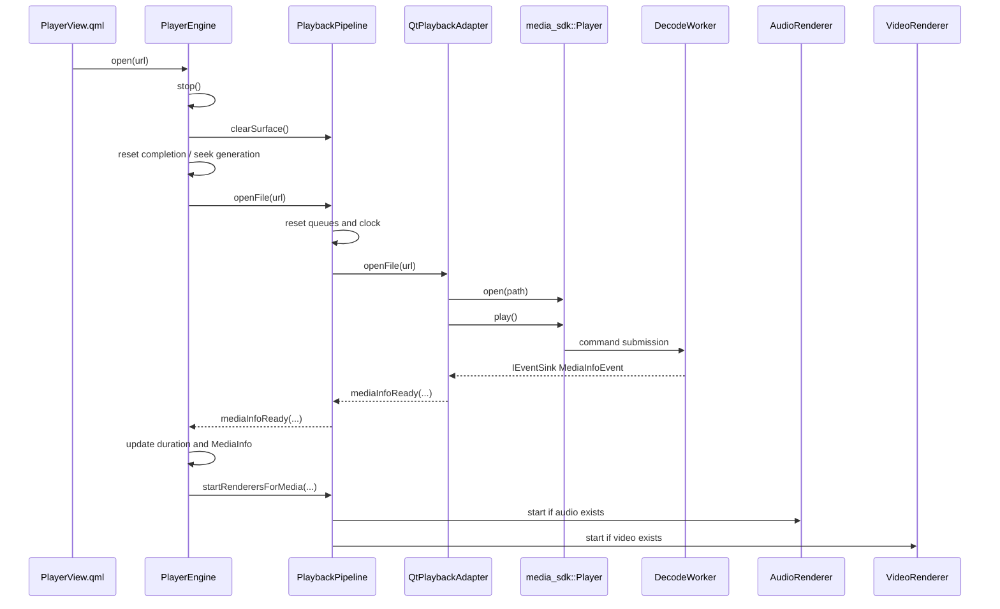

<!--
本文件记录 PlayPlugin 播放器模块在 B+ 媒体 SDK 迁移完成后的运行流程、线程模型、
关键组件职责和设计约束。
-->

# PlayPlugin 播放器执行流程与设计复盘

## 1. 模块定位

`PlayPlugin` 是宿主 `PluginBasedApp` 内置的播放器插件。插件仍只通过
`IAppPlugin` 暴露元信息和 QML 入口；播放内核已经下沉到 Qt-free 的
`media_sdk::Player` / `DecodeWorker`，Qt 插件侧只保留 QML 门面、Qt adapter、
音频输出和 Qt RHI/Scene Graph 视频呈现。

核心目标：

- 宿主只依赖 `IAppPlugin`，不感知播放实现。
- QML 侧 API 保持为 `PlayerEngine`、`PlaylistModel`、`FFmpegSurface`。
- 编解码、demux、frame contract、时钟推进和播放 worker 位于 `sdk/media_core`。
- PlayPlugin 通过 `QtPlaybackAdapter` 把 SDK event 转成 Qt 信号和现有帧队列输入。
- Qt RHI、`QAudioSink` 和 QML 生命周期不进入 SDK core。

## 2. 核心组件职责

| 组件 | 职责 |
| --- | --- |
| `PlayPlugin` | 宿主插件入口，实现 `IAppPlugin`，提供 QML 入口和翻译资源路径。 |
| `PlayPluginView.qml` | 插件 QML 根页面，组合播放器区域和播放列表抽屉。 |
| `PlayerView.qml` | 创建 `PlayerEngine`、`PlaylistModel`、`FFmpegSurface` 和控制栏。 |
| `PlayerEngine` | QML-facing 播放门面，维护 QML 属性、错误、当前媒体和播放状态。 |
| `PlaybackPipeline` | Qt 播放管线，拥有队列、时钟、adapter、音频渲染器和视频渲染器。 |
| `QtPlaybackAdapter` | 持有 `media_sdk::Player`，实现 `IEventSink`，把 SDK event marshal 到 Qt 线程。 |
| `media_sdk::Player` | SDK 播放入口，向 `PlaybackController` 提交 open/play/pause/seek/stop 命令。 |
| `DecodeWorker` | SDK 内部 `std::jthread` worker，执行打开媒体、读包、解码、seek、EOF 和 frame scheduling。 |
| `AudioRenderer` | Qt 音频线程，消费 `AudioFrameQueue`，创建和驱动 `QAudioSink`，维护音频主时钟。 |
| `VideoRenderer` | GUI 线程视频调度器，消费 `VideoFrameQueue`，按音频时钟或本地时钟决定 render/wait/drop。 |
| `FFmpegSurface` | QML 视频输出项，接收待显示帧并在 Scene Graph 中创建/更新 `VideoNode`。 |
| `VideoNode` / `VideoMaterial` | 持有 QSG 节点、QRhi 纹理、shader 参数和纹理上传逻辑。 |
| `FrameQueue` | Adapter 与渲染线程之间的阻塞队列，支持 backpressure、flush、abort 和 serial。 |
| `ClockSync` | Qt 侧音频主时钟和视频同步决策。 |
| `PlaybackCompletionTracker` | 跟踪 SDK EOF、音频和视频三路完成状态，决定媒体是否真正结束。 |

## 3. 所有权与线程模型

主要所有权关系：

- 宿主 `PluginManager` 拥有动态库加载器和插件实例。
- QML 侧创建并拥有 `PlayerEngine`、`PlaylistModel`、`FFmpegSurface`。
- `PlayerEngine` 用 `std::unique_ptr<PlaybackPipeline>` 独占播放管线。
- `PlaybackPipeline` 以值成员拥有 `VideoFrameQueue`、`AudioFrameQueue`、`ClockSync`，
  并用 `std::unique_ptr` 拥有 `QtPlaybackAdapter`、`AudioRenderer`、`VideoRenderer`。
- `QtPlaybackAdapter` 独占 `media_sdk::Player`，只以非 owning 指针观察两条 Qt 帧队列。
- `PlaybackPipeline` 对 `FFmpegSurface` 只保存 `QPointer` 观察引用，Surface 仍由 QML 拥有。
- `VideoFrameDataPtr` 使用 shared ownership 跨 GUI/渲染线程保存待显示帧，避免帧在 GPU 上传前释放。

线程分布：

| 线程 | 对象/逻辑 |
| --- | --- |
| GUI 主线程 | QML、`PlayerEngine`、`PlaybackPipeline`、`QtPlaybackAdapter::handleEvent()`、`VideoRenderer` 调度器、`FFmpegSurface::onFrameReady()`。 |
| SDK worker 线程 | `DecodeWorker`，包含 demux、packet/frame decode、seek、EOF、frame scheduling 和 `IEventSink` event 输出。 |
| 音频线程 | `AudioRenderer::run()`、`QAudioSink` 创建/销毁、重采样、音频写入、音频时钟更新。 |
| Qt Scene Graph 渲染线程 | `FFmpegSurface::updatePaintNode()`、`VideoNode`/`VideoMaterial` 的纹理绑定和渲染资源更新。 |

重要约束：

- SDK core 禁止 Qt 类型、Qt 线程模型和 Qt RHI 依赖。
- `IEventSink` 是 SDK 到外部的唯一事件出口，B+ 不引入 Observable 或 CRTP。
- `QtPlaybackAdapter::onEvent()` 只复制 SDK event，并通过 queued invocation 回到 Qt 对象线程。
- `QAudioSink` 必须在线程内创建、使用和销毁，主线程不能直接调用它。
- `QQuickItem::update()` 必须回到 GUI 线程调度，实际节点更新由 Scene Graph 调用。
- `FFmpegSurface` 用 mutex 在 GUI 线程和渲染线程之间移交 `m_pendingFrame`。

## 4. 插件加载与 QML 注册流程

1. 宿主启动后调用 `AppController::initPlugins()`。
2. `PluginManager` 通过 `QPluginLoader` 加载 `PlayPlugin.so`。
3. 动态库加载时，Qt QML 类型注册代码里的 `Q_CONSTRUCTOR_FUNCTION` 自动执行，注册 `PlayPlugin 1.0` 模块中的 C++ 类型。
4. `PluginManager` 调用 `PlayPlugin::initialize()`。
5. 宿主 QML 页面点击插件卡片后，通过 `PlayPlugin::qmlComponentUrl()` 得到 `qrc:/PlayPlugin/qml/PlayPluginView.qml`。
6. 宿主 `Loader` 加载插件 QML 页面。
7. `PlayerView.qml` 创建 `PlayerEngine`、`PlaylistModel` 和 `FFmpegSurface`。
8. `Component.onCompleted` 调用 `engine.setSurface(videoSurface)`，建立视频帧到 Surface 的连接。

`PlayPlugin` 使用单一 `MODULE` target，同时调用 `qt_add_qml_module(... NO_PLUGIN ...)`。
`NO_PLUGIN` 避免宿主插件入口和 QML plugin 入口符号冲突，QML 类型注册代码仍会被编进动态库。

## 5. 打开媒体文件流程

用户点击打开文件或播放列表切换时：

细节：

1. `PlayerEngine::open()` 先调用 `stop()`，确保旧文件的 worker、队列、Surface 状态清掉。
2. `PlaybackPipeline::openFile()` 重置队列 abort 状态、清空队列、使 `ClockSync` 失效。
3. `QtPlaybackAdapter::openFile()` 创建新的 SDK player 状态，转换 `QUrl` 为 `std::filesystem::path`。
4. `media_sdk::Player` 向 `DecodeWorker` 提交 open/play 命令。
5. `DecodeWorker` 在 `std::jthread` 中打开媒体、发现音视频流、打开 codec context。
6. 媒体信息通过 `IEventSink` 发出，adapter 回到 Qt 线程后触发 `mediaInfoReady`。
7. `PlayerEngine::onMediaInfoReady()` 更新 `duration`、`MediaInfo`，并通知管线启动音频/视频渲染器。

## 6. SDK 解码与事件输出

SDK worker 的主循环负责：

1. 消费 command submission：open、play、pause、seek、stop。
2. 暂停时阻塞等待新命令，避免忙等。
3. seek 时执行 FFmpeg seek、flush codec buffers、递增 serial，并发出 `seekCompleted`。
4. 读取 packet 并分发到音频或视频 codec。
5. 解码后的音频帧包装为 SDK `AudioFrameEvent`。
6. 解码后的视频帧经过 SDK `VideoFrameProcessor`，生成 `VideoFrameEvent`。
7. EOF 时向存在的音频/视频流发出完成事件，Qt 侧再向对应队列推入 EOF 标记。

队列策略：

- 有音频时，视频以音频时钟为主；视频队列满可丢帧，避免视频堆积拖慢音频。
- 无音频时，视频就是唯一节奏来源；视频队列保留 backpressure，避免无节制跳帧。
- 音频用阻塞入队，保证音频时钟连续。

## 7. Qt Adapter 转换流程

`QtPlaybackAdapter` 的边界职责：

- SDK event 从 worker 线程进入 `onEvent()`。
- `onEvent()` 复制 `media_sdk::PlayerEvent`，使用 `QMetaObject::invokeMethod(..., Qt::QueuedConnection)` 投递到 Qt 线程。
- `MediaInfoEvent` 转为 `mediaInfoReady(...)` Qt 信号。
- `AudioFrameEvent` 转为 `AVFramePtr`，写入 `AudioFrameQueue`。
- `VideoFrameEvent` 转为 `AVFramePtr`，写入 `VideoFrameQueue`。
- `EndOfFileEvent` 先按媒体流存在性向队列推入 EOF，再发出 `endOfFile()`。
- `ErrorEvent` 转为 `errorOccurred(QString)`。

B+ 仍复用 Qt 侧 `AVFramePtr` 和 `FrameQueue`，这是 adapter 层的兼容边界，不代表 SDK core 暴露 Qt 或 QML 类型。

## 8. 音频渲染流程

`AudioRenderer` 是独立音频线程：

1. `startRenderersForMedia()` 传入源采样率、声道数、sample format、channel layout。
2. 线程启动后重置 `m_stop`、`m_paused`、`m_flush` 和时钟状态。
3. 在线程内创建 `QAudioSink`，固定输出为 48 kHz、2 声道、float interleaved。
4. 初始化 `SwrContext`，把源音频转换为 Qt audio sink 期望的格式。
5. 循环从 `AudioFrameQueue` 阻塞取帧。
6. serial 不匹配的帧直接丢弃，避免 seek 前旧帧污染新位置。
7. EOF 标记帧到达时使 clock 失效并发出 `endOfAudio()`。
8. 普通帧经 `swr_convert()` 转换后分批写入 `QIODevice`。
9. 写入后根据 `QAudioSink::processedUSecs()` 和帧 PTS 更新 `ClockSync`。
10. 每约 100 ms 发出一次 `positionChanged()` 给 UI。

## 9. 视频调度与同步流程

`VideoRenderer` 运行在 GUI 线程，由视频队列新帧唤醒和 PTS 动态 single-shot 定时共同驱动。

每次调度推进：

1. 如果暂停或 seek 未完成，直接返回。
2. 优先处理上一次因为太早而暂存的 held frame。
3. 否则从 `VideoFrameQueue` 非阻塞取帧。
4. serial 不匹配说明是 seek 前旧帧，丢弃。
5. EOF 标记帧到达时发出 `endOfVideo()`。
6. 根据帧 PTS 和主时钟做同步决策。
7. 决策为 `Wait` 时暂存该帧，并按目标显示时刻安排下一次唤醒。
8. 决策为 `Drop` 时丢帧追赶，但连续丢帧超过阈值后强制渲染一帧。
9. 决策为 `Render` 时发出 `positionChanged()` 和 `frameReady(VideoFrameDataPtr)`。

## 10. Surface 与 GPU 渲染流程

`FFmpegSurface` 是 `QQuickItem`：

1. `VideoRenderer::frameReady` 连接到 `FFmpegSurface::onFrameReady()`。
2. `onFrameReady()` 用 mutex 写入 `m_pendingFrame`，设置 dirty，并通过 queued invocation 调用 `update()`。
3. Qt Scene Graph 调用 `updatePaintNode()`。
4. `updatePaintNode()` 把 pending frame 移出，计算视频实际绘制矩形。
5. `VideoNode::setFrame()` 根据帧类型选择原生路径或软件路径。

软件 YUV 路径继续由 `VideoPixelFormat`、`VideoNode`、`VideoMaterial` 和 shader 完成。
VideoToolbox 原生路径仍属于 Qt 呈现层；如果原生纹理创建失败，
`FFmpegSurface` 发出 `nativeRenderingFailed()`，`PlaybackPipeline` 通知 adapter 关闭直出偏好，后续走 CPU fallback。

## 11. seek 流程

1. `PlayerEngine::seek(positionMs)` 增加 `m_seekGeneration`。
2. `PlaybackPipeline::seek(positionMs, generation)` 固定 Qt 侧副作用顺序。
3. `VideoRenderer::beginSeek(generation)` 丢弃 held frame 并暂停旧画面推进。
4. `AudioRenderer::setAcceptedSerial(generation)` 临时丢弃旧音频帧。
5. `QtPlaybackAdapter::seekTo(positionMs, generation)` 提交 SDK seek。
6. `AudioRenderer::flush()` 清空音频队列、重置 sink 和 clock。
7. `VideoRenderer::flush()` 清空视频 renderer 内部 held frame 和时钟。
8. `ClockSync::invalidate()` 使主时钟失效。
9. SDK seek 完成后 adapter 发出 `seekCompleted(generation, serial)`。
10. `PlaybackPipeline::onDecoderSeekCompleted()` 设置音视频接受 serial，并完成视频 seek。

## 12. 停止与销毁流程

- `PlayerEngine::stop()` 重置 QML 状态、完成状态、position/duration，并调用 `PlaybackPipeline::stopComponents()`。
- `PlaybackPipeline::stopComponents()` 停止 SDK player、音频线程和视频调度器，abort 并清空队列，使时钟失效。
- `QtPlaybackAdapter` 析构时停止 `media_sdk::Player`，确保 SDK worker 不再回调 adapter。
- `AudioRenderer` 在线程内销毁 `QAudioSink`。
- `FFmpegSurface` 销毁时释放 Scene Graph 节点和 pending frame。

## 13. 设计约束

- B+ 不把 `FFmpegSurface`、`VideoNode`、`VideoMaterial`、Qt RHI 或 `QAudioSink` 移入 SDK。
- B+ 不承诺第三方二进制 ABI；当前稳定源码级 C++20 API。
- SDK core 使用 `std::jthread` / `std::stop_token`，不使用 `QThread`。
- SDK core 不依赖 QObject、signals/slots、QString、QUrl、QRhi、QSG、QAudio。
- Qt adapter 是唯一知道两边类型的桥接层。
- 后续 C 阶段可以在 core 边界稳定后再抽 `IAudioSink`、`IVideoPresenter`、OpenGL/Qt RHI presenter。
