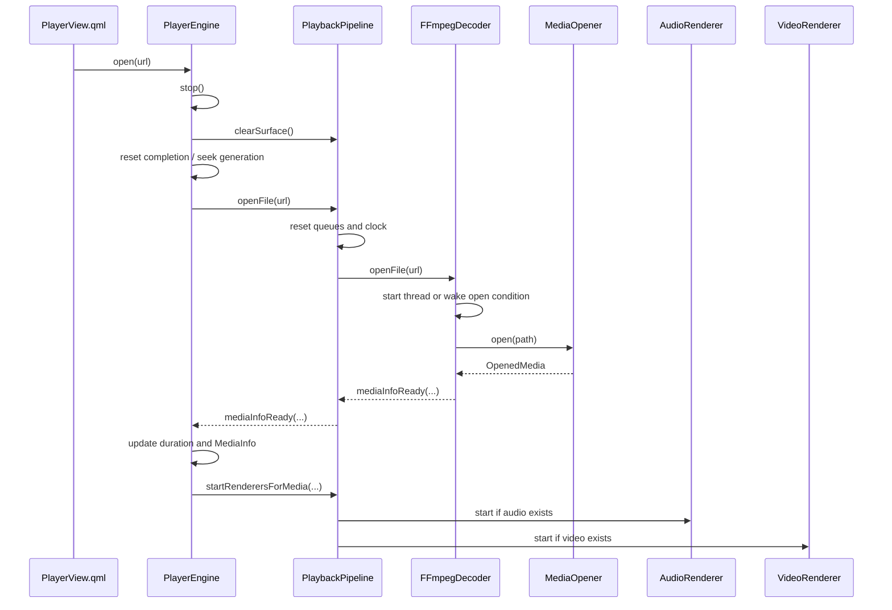

<!--
本文件记录 PlayPlugin 播放器模块的运行流程、线程模型、关键组件职责和设计难点。
它用于帮助后续维护者理解播放器从插件加载到解码、同步、渲染和退出的完整链路。
-->

# PlayPlugin 播放器执行流程与设计复盘

## 1. 模块定位

`PlayPlugin` 是宿主 `PluginBasedApp` 内置的播放器插件。它通过 `IAppPlugin` 暴露插件元信息和 QML 入口，同时把真正的播放逻辑封装在插件自己的 QML 模块和 C++ 后端中。

核心目标：

- 插件对宿主只暴露 `IAppPlugin` 接口，不把播放细节泄露到宿主。
- QML 侧只面对稳定的 `PlayerEngine`、`PlaylistModel`、`FFmpegSurface` 等类型。
- 解码、音频输出、视频同步、Scene Graph 渲染和硬解回退各自收敛到独立组件。
- 播放器可以在插件卸载、QML 页面销毁、停止/重开文件、seek、EOF 等路径上安全退出。

## 2. 核心组件职责

| 组件 | 职责 |
| --- | --- |
| `PlayPlugin` | 宿主插件入口，实现 `IAppPlugin`，提供 QML 入口和翻译资源路径。 |
| `PlayPluginView.qml` | 插件 QML 根页面，组合播放器区域和播放列表抽屉。 |
| `PlayerView.qml` | 创建 `PlayerEngine`、`PlaylistModel`、`FFmpegSurface` 和控制栏。 |
| `PlayerEngine` | QML-facing 播放门面，维护 QML 属性、错误、当前媒体和播放状态。 |
| `PlaybackPipeline` | 内部播放管线，拥有队列、时钟、解码器、音频渲染器和视频渲染器。 |
| `FFmpegDecoder` | 独立解码线程，打开媒体、读包、解码、seek、向队列生产帧。 |
| `AudioRenderer` | 独立音频线程，重采样并写入 `QAudioSink`，维护音频主时钟。 |
| `VideoRenderer` | GUI 线程定时器驱动的视频调度器，从视频队列取帧并按时钟决定渲染/等待/丢帧。 |
| `FFmpegSurface` | QML 视频输出项，接收待显示帧并在 Scene Graph 中创建/更新 `VideoNode`。 |
| `VideoNode` / `VideoMaterial` | 持有 QSG 节点、QRhi 纹理、shader 参数和纹理上传逻辑。 |
| `FrameQueue` | 解码线程与渲染线程之间的阻塞队列，支持 backpressure、flush、abort 和 serial。 |
| `ClockSync` | 音频主时钟和视频同步决策。 |
| `PlaybackCompletionTracker` | 跟踪 decoder/audio/video 三路完成状态，决定媒体是否真正结束。 |
| `PlaybackSeekCoordinator` | 固定 seek 副作用顺序，协调 decoder、音频、视频、队列和时钟。 |

## 3. 所有权与线程模型

主要所有权关系：

- 宿主 `PluginManager` 拥有 `PlayPlugin` 动态库加载器和插件实例。
- QML 引擎加载 `PlayPluginView.qml`，QML 侧创建并拥有 `PlayerEngine`、`PlaylistModel`、`FFmpegSurface`。
- `PlayerEngine` 用 `std::unique_ptr<PlaybackPipeline>` 独占播放管线。
- `PlaybackPipeline` 以值成员拥有 `VideoFrameQueue`、`AudioFrameQueue`、`ClockSync`，并用 `std::unique_ptr` 拥有 `FFmpegDecoder`、`AudioRenderer`、`VideoRenderer`。
- `PlaybackPipeline` 对 `FFmpegSurface` 只保存 `QPointer` 观察引用，Surface 仍由 QML 拥有。
- `FFmpegDecoder` 拥有当前打开文件的 FFmpeg 上下文、硬解 backend 和解码 helper。
- `VideoFrameDataPtr` 使用 shared ownership 跨 GUI/渲染线程保存待显示帧，避免帧在 GPU 上传前释放。

线程分布：

| 线程 | 对象/逻辑 |
| --- | --- |
| GUI 主线程 | QML、`PlayerEngine`、`PlaybackPipeline`、`VideoRenderer` 定时器、`FFmpegSurface::onFrameReady()`。 |
| 解码线程 | `FFmpegDecoder::run()`、FFmpeg `av_read_frame`、packet/frame 解码、视频帧预处理。 |
| 音频线程 | `AudioRenderer::run()`、`QAudioSink` 创建/销毁、重采样、音频写入、音频时钟更新。 |
| Qt Scene Graph 渲染线程 | `FFmpegSurface::updatePaintNode()`、`VideoNode`/`VideoMaterial` 的纹理绑定和渲染资源更新。 |

重要约束：

- `QAudioSink` 必须在线程内创建、使用和销毁，主线程不能直接调用它。
- `QQuickItem::update()` 必须回到 GUI 线程调度，实际节点更新由 Scene Graph 调用。
- `FFmpegSurface` 用 mutex 在 GUI 线程和渲染线程之间移交 `m_pendingFrame`。
- 解码器和渲染器通过 `FrameQueue` 解耦，不能互相直接访问线程内部对象。

## 4. 插件加载与 QML 注册流程

1. 宿主启动后先调用 `AppController::initPlugins()`。
2. `PluginManager` 通过 `QPluginLoader` 加载 `PlayPlugin.so`。
3. 动态库加载时，Qt QML 类型注册代码里的 `Q_CONSTRUCTOR_FUNCTION` 自动执行，注册 `PlayPlugin 1.0` 模块中的 C++ 类型。
4. `PluginManager` 调用 `PlayPlugin::initialize()`。
5. 宿主 QML 页面点击插件卡片后，通过 `PlayPlugin::qmlComponentUrl()` 得到 `qrc:/PlayPlugin/qml/PlayPluginView.qml`。
6. 宿主 `Loader` 加载插件 QML 页面。
7. `PlayerView.qml` 创建 `PlayerEngine`、`PlaylistModel` 和 `FFmpegSurface`。
8. `Component.onCompleted` 调用 `engine.setSurface(videoSurface)`，建立视频帧到 Surface 的连接。

`PlayPlugin` 使用单一 `MODULE` target，同时调用 `qt_add_qml_module(... NO_PLUGIN ...)`。这是为了避免 `Q_PLUGIN_METADATA(IAppPlugin_IID)` 生成的 Qt plugin 入口和 QML plugin 入口符号冲突。`NO_PLUGIN` 让库里只保留宿主插件入口，但 QML 类型注册代码仍会被编进动态库。

## 5. 打开媒体文件流程

用户点击打开文件或播放列表切换时，流程如下：



细节：

1. `PlayerEngine::open()` 先调用 `stop()`，确保旧文件的线程、队列、Surface 状态清掉。
2. `PlaybackPipeline::openFile()` 重置队列 abort 状态、清空队列、使 `ClockSync` 失效。
3. `FFmpegDecoder::openFile()` 设置 pending path 和 open request，然后启动或唤醒解码线程。
4. `FFmpegDecoder::run()` 取出 open request，清空队列，调用 `openInternal()`。
5. `MediaOpener` 执行 `avformat_open_input`、`avformat_find_stream_info`、选择音视频流、打开 codec context。
6. 如果当前平台和 codec 支持硬解，`MediaOpener` 会通过 `HardwareDecoderFactory` 创建 backend 并配置 codec context；失败则回退软件解码。
7. 媒体信息准备好后，`PlayerEngine::onMediaInfoReady()` 更新 `duration`、`MediaInfo`，并通知管线启动音频/视频渲染器。

## 6. 解码主循环

`FFmpegDecoder` 是一个长期存在的 `QThread` 对象。线程启动后外层循环等待 open 请求；每个文件内部执行一次 `decodeLoop()`。

主循环执行顺序：

1. 检查暂停状态。暂停时等待 `seekCond`，不忙等消耗 CPU。
2. 通过 `DecodeLoopControl::consumeSeekRequest()` 消费 seek 请求。
3. 如果有 seek，调用 `doSeek()`，递增/切换 flush serial，清空队列，发出 `seekCompleted`。
4. 调用 `av_read_frame()` 读取 packet。
5. EOF 时向存在的音频/视频队列推入 EOF 标记帧，发出 `endOfFile()`，然后通过 `DecodeLoopControl::waitAfterEof()` 等待 stop、新 open 或 EOF 后 seek。
6. 普通 packet 按 stream index 分发到视频或音频 codec。
7. `StreamFrameDecoder` 负责 `avcodec_send_packet()`、循环 `avcodec_receive_frame()`，并把 PTS 归一化为微秒。
8. 视频帧进入 `VideoFrameProcessor`：
   - 如果启用 VideoToolbox 直出且帧是 `AV_PIX_FMT_VIDEOTOOLBOX`，保留硬件帧。
   - 否则硬件帧先 transfer 到 CPU 帧。
   - 不支持的像素格式用 swscale 归一化为 `YUV420P`。
   - 保留 PTS、色彩范围、色彩空间等元数据。
9. 视频帧进入 `VideoFrameQueue`，音频帧进入 `AudioFrameQueue`。

队列策略：

- 有音频时，视频以音频时钟为主；视频队列满会 `tryPush` 失败并丢帧，避免视频堆积拖慢音频。
- 无音频时，视频就是唯一节奏来源；视频队列用阻塞 `push` 保留 backpressure，避免跳帧。
- 音频用阻塞 `push`，保证音频时钟连续。

## 7. 音频渲染流程

`AudioRenderer` 是独立音频线程：

1. `startRenderersForMedia()` 传入源采样率、声道数、sample format、channel layout。
2. 线程启动后重置 `m_stop`、`m_paused`、`m_flush` 和时钟状态。
3. 在线程内创建 `QAudioSink`，固定输出为 48 kHz、2 声道、float interleaved。
4. 初始化 `SwrContext`，把源音频转换为 Qt audio sink 期望的格式。
5. 循环从 `AudioFrameQueue` 阻塞取帧。
6. serial 不匹配的帧直接丢弃，避免 seek 前旧帧污染新位置。
7. EOF 标记帧到达时使 clock 失效并发出 `endOfAudio()`。
8. 普通帧经 `swr_convert()` 转换后分批写入 `QIODevice`。
9. 写入后根据 `QAudioSink::processedUSecs()` 和帧 PTS 更新 `ClockSync`。
10. 每约 100 ms 发出一次 `positionChanged()` 给 UI。

暂停/恢复的关键点：

- 主线程 `setPaused()` 只写原子标志，不直接调用 `QAudioSink`。
- 音频线程在循环里检测标志变化，在自己的线程内调用 `suspend()` 或 `resume()`。
- 暂停时 `ClockSync` 冻结；恢复时从冻结点继续，避免视频定时器误判大量帧过期。

## 8. 视频调度与同步流程

`VideoRenderer` 运行在 GUI 线程，由视频队列新帧唤醒和 PTS 动态
`single-shot` 定时共同驱动。

每次调度推进：

1. 如果暂停或 seek 未完成，直接返回。
2. 优先处理上一次因为太早而暂存的 held frame。
3. 否则从 `VideoFrameQueue` 非阻塞取帧。
4. serial 不匹配说明是 seek 前旧帧，丢弃。
5. EOF 标记帧到达时发出 `endOfVideo()`。
6. 根据帧 PTS 和主时钟做同步决策：
   - 有音频：读取 `ClockSync::audioClockFast()` 后用 `VideoFrameScheduler` 计算。
   - 无音频：使用内部 `QElapsedTimer` 形成视频时钟。
7. 决策为 `Wait` 时暂存该帧，并按 `framePtsUs - clockUs` 计算下一次
   `single-shot` 唤醒时间；唤醒后重新读取时钟再判断。
8. 决策为 `Drop` 时丢帧追赶，但连续丢帧超过阈值后强制渲染一帧，避免长时间黑屏或不更新。
9. 决策为 `Render` 时发出 `positionChanged()` 和 `frameReady(VideoFrameDataPtr)`，
   然后立即安排下一次调度推进。

同步阈值来自 `VideoFrameScheduler`：

- 视频帧早于主时钟超过提交提前量：等待到接近目标显示时刻。
- 视频帧比音频时钟晚超过 100 ms：丢帧。
- 其余情况：渲染。

## 9. Surface 与 GPU 渲染流程

`FFmpegSurface` 是 `QQuickItem`：

1. `VideoRenderer::frameReady` 连接到 `FFmpegSurface::onFrameReady()`。
2. `onFrameReady()` 用 mutex 写入 `m_pendingFrame`，设置 dirty，并通过 queued invocation 调用 `update()`。
3. Qt Scene Graph 调用 `updatePaintNode()`。
4. `updatePaintNode()` 把 pending frame 移出，计算视频实际绘制矩形。
5. 如果没有节点则创建 `VideoNode`。
6. `VideoNode::setFrame()` 根据帧类型选择原生路径或软件路径。

软件 YUV 路径：

- `VideoPixelFormat` 把 FFmpeg 像素格式映射为平面布局、RHI texture format、shader format mode。
- `VideoNode` 按视频尺寸和像素格式创建/复用 Y、U、V 或 Y、UV、placeholder V 纹理。
- `VideoMaterial::VideoShader::updateSampledImage()` 上传各 plane 数据。
- fragment shader 根据 full/limited range、BT.601/BT.709、8/10-bit、planar/semiplanar 参数完成 YUV 到 RGB。

VideoToolbox 原生路径：

- macOS 且 Scene Graph 使用 Metal RHI 时，`FFmpegSurface::supportsNativeVideoToolboxRendering()` 返回 true。
- `PlaybackPipeline` 把 direct-render 开关传给 `FFmpegDecoder`。
- `VideoFrameProcessor` 对 `AV_PIX_FMT_VIDEOTOOLBOX` 帧不做 CPU transfer，保留硬件帧。
- `VideoRenderer` 从 `CVPixelBuffer` 元数据判断 full range、10-bit、BT.709 等。
- `VideoNode` 使用 `AppleMetalVideoTextureBridge` 从 VideoToolbox frame 创建 Metal/RHI 纹理集合。
- 如果原生纹理创建失败，`FFmpegSurface` 发出 `nativeRenderingFailed()`，`PlaybackPipeline` 关闭直出，后续走 CPU fallback。

## 10. seek 流程

seek 需要同时影响 decoder、audio renderer、video renderer、队列、时钟和 UI。当前由 `PlaybackSeekCoordinator` 固定顺序：

1. `PlayerEngine::seek(positionMs)` 增加 `m_seekGeneration`。
2. `PlaybackPipeline::seek(positionMs, generation)` 委托 `PlaybackSeekCoordinator`。
3. `VideoRenderer::beginSeek(generation)`：
   - 丢弃 held frame。
   - 重置视频时钟和渲染统计。
   - 临时接受 generation serial。
   - 标记 seek pending，避免新帧未准备好时继续渲染旧画面。
4. `AudioRenderer::setAcceptedSerial(generation)` 临时丢弃旧音频帧。
5. `FFmpegDecoder::seekTo(positionMs, generation)` 设置 seek request 并唤醒解码线程。
6. `AudioRenderer::flush()` 清空音频队列、重置 sink 和 clock。
7. `VideoRenderer::flush()` 清空视频 renderer 内部 held frame 和时钟。
8. `ClockSync::invalidate()` 使主时钟失效。
9. 解码线程执行 `doSeek()`：
   - `av_seek_frame()`。
   - `avcodec_flush_buffers()`。
   - 设置新的 `m_flushSerial`。
   - flush 音视频队列。
10. 解码线程发出 `seekCompleted(generation, serial)`。
11. `PlaybackSeekCoordinator::complete()` 把 audio/video accepted serial 切换到 decoder 返回的 serial。

为什么需要 generation 和 serial 两层标识：

- generation 是 UI/协调层发起 seek 的标识，用于识别当前 seek 请求。
- serial 是 decoder 完成 seek 后给新帧流的标识，用于消费侧丢弃旧队列帧。
- seek 中途可能有旧帧、旧 EOF 或多次 seek 交错，两个标识能避免消费侧误接收过期帧。

## 11. 暂停、恢复、停止和 EOF

### 暂停

`PlayerEngine::pause()` 调用 `PlaybackPipeline::setPaused(true)`：

- decoder 暂停读包，但仍能响应 seek。
- audio renderer 在线程内 suspend sink 并冻结 clock。
- video renderer 标记暂停；timer 不推进新帧。
- Surface 保留最后一帧纹理，不清屏。

### 恢复

`PlayerEngine::play()` 调用 `setPaused(false)`：

- decoder 被唤醒继续读包。
- audio renderer resume sink，clock 从冻结点继续。
- video renderer 恢复 timer 逻辑。

### 停止

`PlayerEngine::stop()` 调用 `stopAllComponents()`，最终进入 `PlaybackPipeline::stopComponents()`：

1. `FFmpegDecoder::stopDecoding()` 设置 stop 标志，abort 队列，唤醒 open/seek 等待。
2. 等待解码线程退出。
3. `AudioRenderer::stopRenderer()` 设置 stop 并 abort 音频队列。
4. 等待音频线程退出。
5. 停止并重置 `VideoRenderer`。
6. flush 音视频队列并 reset abort。
7. `PlayerEngine` 重置 position、duration、completion、MediaInfo，并清理 Surface。

### EOF

EOF 不是 decoder 到文件末尾就立刻结束播放：

1. decoder 读到 EOF 后推送音频/视频 EOF 标记帧，并发出 `endOfFile()`。
2. `PlayerEngine` 标记 decoder finished。
3. audio renderer 消费完队列并遇到 EOF 后发出 `endOfAudio()`。
4. video renderer 消费完队列并遇到 EOF 后发出 `endOfVideo()`。
5. `PlaybackCompletionTracker::shouldFinish()` 只有在 decoder、音频、视频都完成后才返回 true。
6. `PlayerEngine::finishMedia()` 暂停管线、设置 QML 状态为 Paused，并发出 `endOfMedia()`。

这样可以避免 decoder 先 EOF 后直接 stop，导致音频缓冲或视频队列尾部帧被截断。

## 12. 错误处理与回退

主要错误路径：

- 媒体打开失败：`MediaOpener` 返回 `MediaOpenResult{ok=false}`，decoder 发出 `errorOccurred`。
- codec 打开失败：视频或音频单路失败时尽量保留另一条流；两条都失败才报错。
- 硬解配置或打开失败：记录 warn，释放硬解 backend，重新走软件 codec。
- 硬件帧 transfer CPU 失败：限频记录 warn，丢弃该帧。
- 原生 VideoToolbox texture 创建失败：Surface 发信号，pipeline 关闭 direct rendering，后续 fallback。
- `QAudioSink` 或重采样失败：audio renderer 发出 error，`PlayerEngine` 停止播放并重置公开状态。

错误最终都会通过 `PlayerEngine::errorOccurred` 进入 QML，`PlayerView.qml` 显示 error bar 并写日志。

## 13. 设计过程中的主要难点

### 13.1 Qt 插件入口与 QML 模块入口冲突

`PlayPlugin` 既是宿主插件，又是 QML 模块。如果让 `qt_add_qml_module` 默认生成 QML plugin 入口，同时 `PlayPlugin.cpp` 又用 `Q_PLUGIN_METADATA(IAppPlugin_IID)` 生成宿主插件入口，会出现 duplicate symbol。

当前方案是单一 MODULE target + `qt_add_qml_module(NO_PLUGIN)`：

- 动态库里只有一个宿主插件入口。
- QML 类型注册代码仍被编译进库并在 dlopen 时自动执行。
- 构建结构比双 target 简单，也避免插件二进制和 QML 类型注册分裂。

### 13.2 QML 生命周期与插件生命周期不一致

`PlayPlugin` 实例由宿主管理，但 `PlayerEngine` 由 QML 创建。插件 shutdown 时可能没有 QML 页面，也可能页面仍存在。为避免插件直接拥有 QML 对象，当前通过 `PlaybackContext` 注册当前 engine，`PlayPlugin::shutdown()` 只在 engine 存在时调用 `stop()`。

难点是不能让插件析构直接 delete QML 对象，也不能让 QML 对象持有插件实例。现在两边通过轻量上下文解耦，生命周期更清楚。

### 13.3 QAudioSink 线程亲和性

`QAudioSink` 不是可以随便跨线程调用的对象。音量、静音、暂停、flush 都可能来自 GUI 线程，但 sink 创建在音频线程。

当前处理方式：

- GUI 线程只写原子标志或受 mutex 保护的参数。
- 音频线程在循环内统一应用 sink 操作。
- stop 时通过队列 abort 唤醒阻塞 pop，确保线程能退出。

### 13.4 Scene Graph 渲染线程与帧生命周期

`FFmpegSurface::onFrameReady()` 和 `updatePaintNode()` 不一定在同一线程。视频帧如果在 GUI 线程收到后立即释放，渲染线程上传纹理时可能访问悬空内存。

当前处理方式：

- 用 `VideoFrameDataPtr` 保存 frame shared ownership。
- `FFmpegSurface` 用 mutex 把 pending frame 从 GUI 线程移交给渲染线程。
- `VideoMaterial` 持有 `currentFrame`，保证当前 GPU 资源更新依赖的 AVFrame 生命周期足够长。

### 13.5 音视频同步和视频-only 播放

有音频时，音频设备实际播放进度才是最可靠主时钟；没有音频时，播放器仍需要独立视频时钟。

当前处理方式：

- 有音频：`AudioRenderer` 更新 `ClockSync`，`VideoRenderer` 按音频时钟 wait/drop/render。
- 无音频：`VideoRenderer` 用内部 `QElapsedTimer` 从首帧 PTS 建立视频时钟。
- 暂停时冻结 clock，恢复时继续，避免恢复后大量帧被误判为 late。

### 13.6 seek 的旧帧污染

seek 会同时清空队列、flush decoder、重置音频设备、重置视频 held frame。任何一步顺序错误，都可能出现 seek 后闪回旧画面、旧音频继续播放或 EOF 状态误触发。

当前处理方式：

- `PlaybackSeekCoordinator` 固定 seek side effect 顺序。
- `FrameQueue` 和消费侧都带 serial。
- `VideoRenderer` 在 seek pending 时暂停渲染，直到 decoder 完成 seek。
- audio/video accepted serial 只有在 decoder 返回新 serial 后才切到最终值。

### 13.7 EOF 后仍需允许 seek

播放结束后用户拖动进度条重新播放是常见行为。decoder EOF 后如果直接退出到完全停止状态，seek 请求可能无处处理。

当前处理方式：

- EOF 后 decoder 通过 `DecodeLoopControl::waitAfterEof()` 等待 stop、新 open 或 seek。
- `PlaybackCompletionTracker::resumeAfterFinishedSeek()` 在 finished 状态 seek 时恢复 completion flags。
- seek 后 pipeline 取消 paused 并回到 Playing。

### 13.8 硬解直出与 CPU fallback

VideoToolbox 硬解帧可以减少 CPU copy，但只有在 Qt Scene Graph 使用 Metal RHI 且原生 texture bridge 可用时才安全。否则必须 transfer 到 CPU。

当前处理方式：

- Surface 运行时判断是否支持 native VideoToolbox rendering。
- Pipeline 把开关传给 decoder。
- Frame processor 在开关开启时保留 VideoToolbox frame，否则 transfer 到 CPU。
- Surface 原生纹理创建失败后主动通知 pipeline 关闭直出，避免持续失败。

### 13.9 像素格式和色彩范围

播放器不能假设所有视频都是 8-bit YUV420P。当前需要处理 NV12、P010、YUV420P10、YUV422P10、YUV444P10 等格式，还要区分 full/limited range 和 BT.601/BT.709。

当前处理方式：

- `VideoPixelFormat` 统一描述 plane layout、chroma 尺寸、RHI texture format 和 shader mode。
- 不支持的格式在 `VideoFrameProcessor` 中 swscale 到 YUV420P。
- full range 由 `AVFrame::color_range` 或 native frame metadata 判断。
- BT.709 由 frame colorspace 或宽度 >= 1280 的兜底规则判断。

### 13.10 大类拆分边界

早期 `PlayerEngine`、`FFmpegDecoder`、`FFmpegSurface` 都容易变成“什么都管”的类。直接套复杂设计模式会增加抽象成本，反而不利于维护。

当前拆分策略比较保守：

- QML-facing 类保留 public API 和信号。
- 内部用非 QObject helper 或小协调器拆职责。
- 只有真正存在多策略的地方才使用类似 Strategy 的思路，例如硬解 backend、未来渲染 backend。
- 使用架构检查防止职责重新长回大类。

## 14. 当前仍需注意的维护点

- `FFmpegDecoder` 仍然是解码线程 facade，保留了 read loop、队列策略、signal emission 等核心职责；继续拆分时要避免把线程生命周期拆散。
- `FFmpegSurface` 已经拆出 node/material/format/geometry，但原生和软件渲染 backend 还可以进一步策略化。
- `AudioRenderer` 对 `QAudioSink` 的线程规则很敏感，任何改动都要保证 sink 操作仍在音频线程。
- seek/EOF/stop 是最容易回归的路径，改动后必须手动验证：播放、暂停、seek、EOF 后 seek、停止后重开、音频-only、视频-only。
- 硬解直出依赖 macOS + Metal RHI，其他平台目前主要走硬解到 CPU 或软件解码路径。

## 15. 快速执行链路摘要

```text
宿主加载 PlayPlugin.so
  -> QML 类型注册
  -> PlayPlugin::initialize()
  -> Loader 加载 PlayPluginView.qml
  -> PlayerView 创建 PlayerEngine / PlaylistModel / FFmpegSurface
  -> engine.setSurface(videoSurface)
  -> 用户 open 文件
  -> PlayerEngine.open()
  -> PlaybackPipeline.openFile()
  -> FFmpegDecoder 线程 open + decode
  -> MediaOpener 打开输入和 codec
  -> Decoder 生产 audio/video frames 到队列
  -> AudioRenderer 消费音频帧，写 QAudioSink，更新 ClockSync
  -> VideoRenderer 消费视频帧，按 ClockSync 决定 wait/drop/render
  -> FFmpegSurface 接收 frameReady
  -> Scene Graph updatePaintNode
  -> VideoNode / VideoMaterial 上传纹理并用 shader 上屏
  -> EOF 时等待 decoder/audio/video 三路完成
  -> PlayerEngine 发出 endOfMedia 并进入 Paused
```
